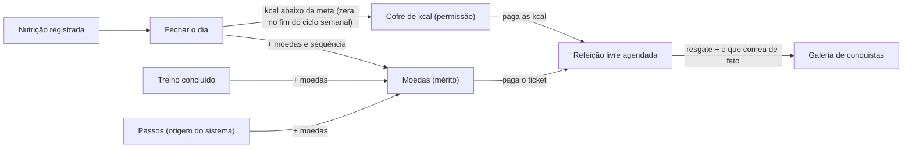

# 🛡️ RPG-LIFE UI Engine: Guia Definitivo Anti-AI Slop & Design de Alta Performance

Este documento é a especificação obrigatória para o desenvolvimento de interfaces no **RPG-LIFE**. Ele define o padrão estético, elimina os vícios gerados automaticamente por modelos de linguagem e estabelece a arquitetura visual do ciclo central do app: **fechar o dia (Nutrição + Treino + Passos) → cofre de kcal + moedas → refeição livre agendada**.

---

## 1. O Diagnóstico: Os 10 Vícios Críticos do Design de IA ("AI Slop")

Quando IAs geram código de front-end sem direcionamento estrito, produzem layouts previsíveis, genéricos e visualmente amadores. Qualquer desenvolvedor ou designer experiente reconhece uma tela de IA em 2 segundos pelos seguintes anti-padrões:

| # | Vício da IA | Por que é ruim? | Como o Dev Sênior resolve |
|---|---|---|---|
| 1 | **Gradientes Clichês** (`from-indigo-500 to-purple-600` ou `from-amber-500 to-yellow-400` em botões/títulos) | Parece template de curso de 2020. Falta de identidade e sofisticação. | Superfícies sólidas monocromáticas com micro-bordas sutis (`border-white/[0.08]`) e acentos de cor únicos aplicados com moderação cirúrgica. |
| 2 | **Div Soup / Nested Card Syndrome** (Caixas dentro de caixas) | Um card cinza dentro de um card cinza dentro de outro card cinza (`bg-neutral-900 > bg-neutral-950`). Gera poluição visual e sensação claustrofóbica. | Hierarquia por contraste tipográfico, linhas divisórias finas (`divide-y divide-white/[0.04]`), espaços negativos e tabelas/listas contidas, sem engaiolar cada número em uma caixa. |
| 3 | **Emojis como Ícones** (`🍔`, `🪙`, `🎯`, `🔥`) | Destrói a seriedade e o polimento da interface, parecendo protótipo de brinquedo ou aplicativo infantil. | Ícones SVG vetoriais consistentes (ex: `lucide-react` com `stroke-[1.5px]`), tonalizados em cores semânticas atenuadas. |
| 4 | **Tipografia "Flatline" (Sem Ritmo)** | Textos em tamanhos padrão (`text-sm`, `text-base`), todos com o mesmo peso (`font-bold` ou `font-normal`) e sem tracking. | Headings com `tracking-tight` (-0.02em), rótulos técnicos em micro-tipografia monoespaciada (`text-[10px] font-mono uppercase tracking-widest text-zinc-500`), e valores numéricos com `font-variant-numeric: tabular-nums`. |
| 5 | **Padding Inflado / Falsa Elegância** | Colocar `p-8` e `gap-6` em tudo achando que espaço em branco é design. A tela fica vazia e exige scrolls infinitos para dados simples. | **Alta densidade de informação calculada**. Paddings compactos (`p-3.5` a `p-4.5`), layouts balanceados e densos como o cockpit de um software de precisão (Linear, Bloomberg Terminal, Raycast). |
| 6 | **Ausência de Micro-Interações Refinadas** | Botões sem feedback real ou com saltos grotescos (`hover:-translate-y-1 shadow-2xl`). | Transições ópticas de iluminação de borda (`hover:border-white/20 hover:bg-white/[0.02] active:scale-[0.99] transition-all duration-150 ease-out`). |
| 7 | **Responsividade Preguiçosa** | Colapsar tudo cegamente em `col-span-12` empilhado no mobile, gerando uma tripa vertical quilométrica. | Layouts adaptativos reais: tabelas que viram listas com dados condensados, gráficos com aspect-ratio fixo, gavetas/sheets inferiores para filtros. |
| 8 | **Falta de Estados Reais (Edge Cases)** | Telas projetadas apenas para o caso perfeito (quando tudo tem dados), quebrando quando há zero moedas, valores longos ou dados nulos. | Skeleton loaders fieis ao wireframe, zero-states inspiradores com ação de desbloqueio, e tratamento rigoroso de overflow e nulos. |
| 9 | **Monotonia de Contraste** | Textos secundários em `text-gray-400` que se misturam com o fundo, violando acessibilidade WCAG. | Escala de luminância calibrada: Titular (`#f4f4f5`), Corpo (`#a1a1aa`), Rótulo/Metadado (`#71717a`), Borda base (`rgba(255,255,255,0.06)`). |
| 10 | **Desconexão da Proposta de Valor** | Criar widgets soltos que não conversam entre si, esquecendo o loop central de recompensa do produto. | Toda ação visual reflete o fluxo de valor: **dia fechado (Nutrição/Treino/Passos) ➔ cofre de kcal + moedas ➔ refeição livre agendada**. |

---

## 2. A Filosofia Estética do RPG-LIFE: "Tactical Kinetic HUD"

O RPG-LIFE **não** é um joguinho retrô pixel-art nem um gerenciador corporativo sem graça. 

A identidade visual é um **HUD Tático de Alta Precisão** (inspirado na estética de hardware militar moderno, no minimalismo do *Linear* e na clareza biométrica de relógios Garmin/Apple Ultra):

1. **Superfícies**: Fundo absoluto profundo (`#08090a`), com camadas de elevação em superfícies discretas (`#0c0e12`, `#14171d`). Bordas com precisão cirúrgica de 1px translúcido (`border-white/[0.08]`).
2. **Cores Semânticas Funcionais**:
   - 🪙 **Forged Amber (Moedas & Ticket)**: `#f59e0b` / `amber-400` (Simboliza mérito acumulado e o ticket da refeição livre).
   - ⚡ **Kinetic Crimson/Rose (Treinos & Queima)**: `#f43f5e` / `rose-400` (Simboliza frequência cardíaca, gasto térmico e esforço muscular).
   - 🥗 **Bio Emerald (Nutrição & Balanço)**: `#10b981` / `emerald-400` (Simboliza integridade metabólica, regeneração e déficit controlado).
   - 🛡️ **Titanium Cyan (Cofre de kcal)**: `#06b6d4` / `cyan-400` (Simboliza as kcal guardadas para a refeição livre).

---

## 3. O Loop Central de Produto: fechar o dia → cofre + moedas → refeição livre



### A refeição livre é o ponto focal
Moedas e cofre não são cosméticos: o usuário precisa **ver a próxima refeição livre** o tempo todo e quanto falta para ela ("Rodízio sábado — guarde 360 kcal/dia, faltam 3 dias"). Cada dia fechado o aproxima de algo concreto. Não existe loja de itens, suplementos, upgrades nem recompensa criada pelo usuário; moeda só vem de esforço real.

Cuidado de bem-estar: comer acima da meta aparece como "ajuste do dia", em linguagem neutra, sem perder moeda, XP nem sequência.

---

## 4. O Framework de Prompting Anti-AI Slop

Ao solicitar qualquer tela ou componente a um agente de IA, utilize esta estrutura obrigatória:

```markdown
Você é um Principal Front-End Engineer & UI Designer especializado em interfaces de alta densidade e sofisticação (padrão Linear / Vercel / Raycast).

OBJETIVO:
Construir o componente [NOME] para a aplicação RPG-LIFE.

RESTRIÇÕES VISUAIS OBRIGATÓRIAS (ANTI-AI SLOP):
1. NUNCA use gradientes roxo/índigo (proibido from-indigo-* ou from-purple-*).
2. NUNCA use gradientes multicoloridos clichês em botões ou títulos.
3. NUNCA use emojis (como 🍔, 🪙, 🎯) para representar métricas ou status; utilize ícones SVG de alta precisão de 'lucide-react' com strokeWidth={1.5} ou 1.75.
4. Evite "nested cards" desnecessários (caixas cinzas dentro de caixas cinzas sem propósito de profundidade).
5. Toda métrica numérica deve ter 'font-variant-numeric: tabular-nums' ou classe 'tabular-nums' para evitar saltos visuais.
6. Rótulos e metadados devem usar micro-tipografia monoespaciada: 'text-[10px] font-mono uppercase tracking-widest text-zinc-500'.
7. Bordas devem ser ultra-finas e discretas: 'border border-white/[0.08]'.
8. Superfícies: Fundo principal #08090a, superfícies #0c0e12, hover #14171d.
9. Cores de acento:
   - Moedas/Ticket: Amber (#f59e0b)
   - Treino/Esforço: Rose (#f43f5e)
   - Nutrição/Regeneração: Emerald (#10b981)
   - Reserva/Cofre: Cyan (#06b6d4)
10. O componente deve ser 100% responsivo com mobile-first real e estados de hover e active sutis.
```
