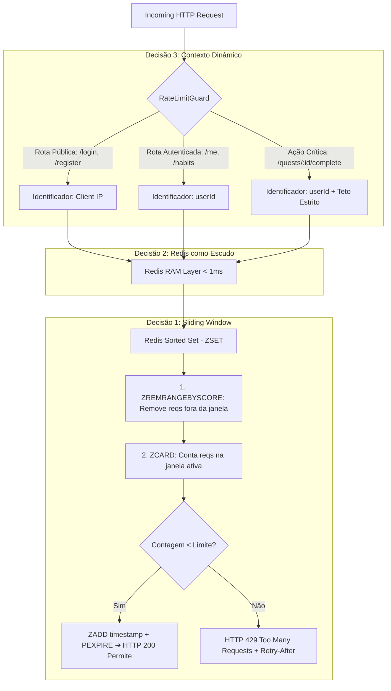

# 🛡️ Arquitetura de Rate Limit com NestJS e Redis

Este documento detalha as **3 decisões arquiteturais de Rate Limit** adotadas no backend do **RPG-LIFE**, acompanhadas da implementação mínima (ideal para print e publicação) e da versão completa modular de produção.

---

## 🎯 As 3 Decisões de Arquitetura



---

### 1. Sliding Window em vez de Fixed Window

#### O Problema do Fixed Window:
No modelo de **Fixed Window** (janela fixa), o contador reinicia a cada virada de minuto (ex: 12:00:00, 12:01:00). Isso abre uma brecha para **rajadas artificiais na borda da janela**:

```text
Fixed Window (Limite: 10 req/min):
12:00:00 ---------------------- 12:00:59 [10 reqs] | 12:01:01 [10 reqs] ---------------------- 12:02:00
                                  ▲                    ▲
                                  └──── Em 2 segundos ──┘
                                  O servidor recebeu 20 REQUISIÇÕES!
```

#### A Solução com Sliding Window (Janela Deslizante contínua):
Avaliamos o tempo de forma contínua com granularidade de milissegundos via **Redis Sorted Sets (ZSET)**:
- Cada requisição é registrada com score = `timestamp atual em ms`.
- Antes de contar, removemos tudo o que tiver score menor que `(now - windowMs)` usando `ZREMRANGEBYSCORE`.
- Contamos os membros ativos com `ZCARD`.
- Não há "virada de minuto"; a janela desliza suavemente a cada milissegundo, eliminando picos artificiais.

---

### 2. Redis como Camada de Controle

- **Zero sobrecarga no banco principal:** Checagens de rate limit acontecem em praticamente toda requisição. Fazer `SELECT`/`UPDATE` de contadores efêmeros no MongoDB ou PostgreSQL satura I/O de disco e conexões do pool.
- **Operações atômicas em memória RAM (< 1ms):** O Redis processa comandos via `multi.exec()` ou script Lua em nanossegundos diretamente na memória.
- **Escudo protetor (Shield):** Bloqueia requisições abusivas antes mesmo de encostarem na regra de negócio ou no banco de dados.

---

### 3. Identificador Dinâmico por Contexto

Limitar tudo por IP pune usuários legítimos e não protege a aplicação de forma cirúrgica. Por isso, a chave de controle é resolvida dinamicamente:

| Contexto | Identificador | Justificativa | Exemplo de Rota |
| :--- | :--- | :--- | :--- |
| **Público (`public`)** | `ip:${clientIp}` | Mitiga ataques de força bruta e DoS onde o atacante não possui credencial. | `POST /user/login`<br>`POST /user/register` |
| **Autenticado (`auth`)** | `user:${userId}` | Evita punir redes inteiras corporativas, faculdades ou operadoras móveis compartilhando o mesmo IP via **CGNAT** ou Wi-Fi público. | `GET /user/me`<br>`GET /habits/today` |
| **Crítico (`critical`)** | `user:${userId}` | Tetos específicos e estritos para operações que geram custo ou alteram a economia do jogo (claims de XP/moedas). | `PATCH /quests/:id/complete` |

---

## 📸 Código Mínimo (Ideal para Printar e Publicar)

Este é o arquivo minimalista pronto para screenshot, localizado em:  
[`rpg-backend/src/modules/common/guards/rate-limit.guard.ts`](file:///c:/Users/schweetz/ProjetosDoWind/RPG-LIFE/rpg-backend/src/modules/common/guards/rate-limit.guard.ts)

```typescript
import {
  Injectable,
  CanActivate,
  ExecutionContext,
  HttpException,
  HttpStatus,
  SetMetadata,
} from '@nestjs/common';
import { Reflector } from '@nestjs/core';
import { Request } from 'express';
import Redis from 'ioredis';

// --- 3. IDENTIFICADOR DINÂMICO POR CONTEXTO ---
export type RateLimitContext = 'public' | 'auth' | 'critical';

export interface RateLimitConfig {
  limit: number;     // Teto máximo de requisições
  windowMs: number;  // Janela deslizante em ms (ex: 60_000 = 1min)
  context: RateLimitContext;
}

export const RATE_LIMIT_KEY = 'RATE_LIMIT_CONFIG';

// Decorators ergonômicos para cada contexto
export const RateLimitPublic = (limit = 5, windowMs = 60_000) =>
  SetMetadata(RATE_LIMIT_KEY, { limit, windowMs, context: 'public' });

export const RateLimitAuth = (limit = 60, windowMs = 60_000) =>
  SetMetadata(RATE_LIMIT_KEY, { limit, windowMs, context: 'auth' });

export const RateLimitCritical = (limit = 5, windowMs = 60_000) =>
  SetMetadata(RATE_LIMIT_KEY, { limit, windowMs, context: 'critical' });

@Injectable()
export class RateLimitGuard implements CanActivate {
  // 2. REDIS COMO CAMADA DE CONTROLE (Memória RAM < 1ms, escudo pro MongoDB)
  private readonly redis = new Redis({
    host: process.env.REDIS_HOST || 'localhost',
    port: Number(process.env.REDIS_PORT) || 6379,
    lazyConnect: true,
  });

  constructor(private readonly reflector: Reflector) {}

  async canActivate(context: ExecutionContext): Promise<boolean> {
    const config = this.reflector.get<RateLimitConfig>(RATE_LIMIT_KEY, context.getHandler());
    if (!config) return true;

    const req = context.switchToHttp().getRequest<Request>();
    const now = Date.now();

    // 3. RESOLUÇÃO DINÂMICA DO IDENTIFICADOR
    // - Público: IP (mitiga força bruta no login/register)
    // - Autenticado / Crítico: userId (evita punir redes inteiras em CGNAT/Wi-Fi compartilhado)
    const user = (req as any).user;
    const identifier = config.context === 'public' || !user?.sub
      ? `ip:${req.ip || req.headers['x-forwarded-for'] || 'unknown'}`
      : `user:${user.sub}`;

    const key = `rl:${config.context}:${identifier}:${req.method}:${req.path}`;

    // 1. SLIDING WINDOW (Avaliação contínua de tempo via Redis ZSET, sem picos artificiais)
    const clearBefore = now - config.windowMs;
    const multi = this.redis.multi();
    multi.zremrangebyscore(key, 0, clearBefore);     // Remove requisições fora da janela
    multi.zcard(key);                                // Conta requisições na janela ativa
    multi.zadd(key, now, `${now}:${Math.random()}`); // Registra a requisição atual
    multi.pexpire(key, config.windowMs);             // Expira automaticamente a chave

    const results = await multi.exec();
    const currentHits = (results?.[1]?.[1] as number) || 0;

    if (currentHits >= config.limit) {
      throw new HttpException(
        {
          statusCode: HttpStatus.TOO_MANY_REQUESTS,
          message: `Taxa limite de requisições excedida para este ${config.context === 'public' ? 'IP' : 'usuário'}.`,
        },
        HttpStatus.TOO_MANY_REQUESTS,
      );
    }

    return true;
  }
}
```

---

## 🎮 Exemplo de Aplicação nos Controllers

### 1. No Controller de Autenticação (`user.controller.ts`):
```typescript
@Controller('user')
export class UserController {

  // Limite por IP: 5 tentativas por minuto para mitigar força bruta
  @Post('login')
  @UseGuards(RateLimitGuard)
  @RateLimitPublic(5, 60_000)
  async login(@Body() body: LoginUserDto) {
    return this.userService.login(body);
  }

  // Limite por userId: 60 requisições por minuto (cada usuário tem sua quota individual)
  @Get('me')
  @UseGuards(JwtAuthGuard, RateLimitGuard)
  @RateLimitAuth(60, 60_000)
  async getMe(@CurrentUser('sub') userId: string) {
    return this.userService.getMe(userId);
  }
}
```

### 2. No Controller de Quests & Economia (`quest.controller.ts`):
```typescript
@Controller('quests')
@UseGuards(JwtAuthGuard)
export class QuestController {

  // Ação crítica: teto restrito de 5 conclusões/min para blindar a economia de XP e Moedas
  @Patch(':id/complete')
  @UseGuards(RateLimitGuard)
  @RateLimitCritical(5, 60_000)
  async completeQuest(
    @CurrentUser('sub') userId: string,
    @Param('id') questId: string,
  ) {
    return this.questService.completeQuest(userId, questId);
  }
}
```

---

## 🚀 Como Executar em Desenvolvimento

1. **Subir o container do Redis:**
```bash
docker compose up -d redis
```

2. **Testar o build no backend:**
```bash
cd rpg-backend
npm run build
```

3. **Resposta quando o limite é excedido (HTTP 429):**
```json
{
  "statusCode": 429,
  "message": "Taxa limite de requisições excedida para este IP.",
  "error": "Too Many Requests",
  "timestamp": "2026-09-08T17:15:00.000Z",
  "path": "/user/login"
}
```
Headers retornados:
- `Retry-After: 48`
- `X-RateLimit-Limit: 5`
- `X-RateLimit-Remaining: 0`
